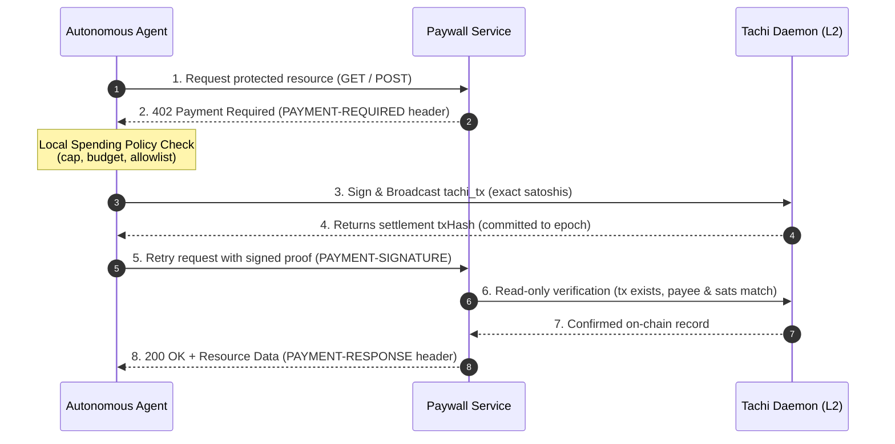

# Sats402 ⚡

**Autonomous x402 Bitcoin Micropayments on Tachi Layer-2**

[](https://sats402.vercel.app)
[](https://regtest.tachibtcscan.com)
[](https://github.com/Johnenyen/Sats402/blob/main/PROTOCOL.md)
[](LICENSE)

Sats402 is an autonomous x402 payment protocol and SDK engineered for **OP_Freedom Bounty #6**. It enables autonomous AI agents and machine-to-machine services to transact in native Bitcoin satoshis over Tachi Layer-2 without custodians, bridges, wrapped tokens, or centralized escrow.

Every payment settles directly on Tachi via agent-signed, agent-broadcast `tachi_tx` transactions. The recipient service verifies settlement by querying the read-only Tachi daemon, and every on-chain settlement is anchored into Tachi's cryptographic Merkle tree with **HAT Commitments** and **RIP Inclusion Proofs**.

🌐 **Live Web Application & Catalog:** [https://sats402.vercel.app](https://sats402.vercel.app)  
🔍 **Live Tachi Explorer:** [https://regtest.tachibtcscan.com](https://regtest.tachibtcscan.com)  
📖 **Protocol Specification:** [PROTOCOL.md](PROTOCOL.md)

---

## Key Guarantees & Features

- **True Self-Custody & Unilateral Exit Rights:** All funds are controlled by the user/agent's own private keys. No escrow, no locked balances, and no third-party custody. Settlements carry cryptographic **HAT Commitments** and **RIP Inclusion Proofs**, guaranteeing unilateral exit rights back to Bitcoin Layer-1.
- **Full x402 v2 Protocol Support:** Implements the official x402 v2 headers (`PAYMENT-REQUIRED`, `PAYMENT-SIGNATURE`, `PAYMENT-RESPONSE`) with cryptographic binding over the payment challenge, payer identity, resource URL, and settlement transaction hash.
- **Agent-to-Service & Agent-to-Agent Settlement:** Supports both autonomous HTTP 402 challenge negotiation (`agent.fetch`) and direct machine-to-machine payments (`agent.pay`).
- **Grounded AI Inference Loop (NVIDIA NIM):** Built-in paid AI inference service powered by `openai/gpt-oss-20b` via NVIDIA NIM. When an agent buys an answer (50 sats), the inference agent autonomously buys live blockchain data from S1 (5 sats) before synthesizing the grounded response.
- **Built-in Spending Policy Engine:** Agents are protected against drained wallets with per-call caps, session budgets, and payee allowlists evaluated locally before any transaction is broadcast.
- **Self-Healing Demo Wallet:** Demo agents automatically check spendable balances and auto-fund from the Tachi faucet (`ensureFunded`) if balances drop below operational thresholds.

---

## Architecture & Monorepo Structure

Sats402 is structured as a clean, modular TypeScript/ESM monorepo:

```
Sats402/
├── packages/
│   ├── core/       # Pure cryptographic protocol primitives & BIP-340 Schnorr verification
│   ├── agent/      # Autonomous agent client, spending policies & coin selection
│   ├── express/    # Zero-custody paywall middleware for HTTP APIs
│   ├── verify/     # Read-only Tachi on-chain settlement verification engine
│   └── cli/        # CLI tool for verifying settlements and querying receipts
├── apps/
│   └── site/       # Production web UI, interactive demo, and receipt verifier
├── api/            # Serverless edge endpoints (services, inference, faucet auto-refill)
└── demo/           # End-to-end cold-start and agent-to-agent payment scripts
```

### Packages Overview

| Package | Description |
| :--- | :--- |
| [`@sats402/core`](packages/core) | Pure cryptographic logic: payment challenge binding, BIP-340 Schnorr signatures, replay prevention keys, and x402 header parsers. |
| [`@sats402/agent`](packages/agent) | High-level autonomous agent client: handles 402 negotiation, coin selection (smallest-sufficient VTXO), spending policies, and direct `agent.pay`. |
| [`@sats402/express`](packages/express) | Drop-in paywall middleware for Express/Node.js servers. Challenges callers with 402, verifies daemon state, and issues idempotent receipts. |
| [`@sats402/verify`](packages/verify) | Read-only settlement verification engine. Validates transaction state (`committed`), epoch height, outputs, and spent inputs against Tachi daemon. |
| [`@sats402/cli`](packages/cli) | Command-line utility for manual and CI/CD settlement verification: `sats402 verify <txHash>`. |

---

## How an x402 Payment Works



1. **Challenge:** Agent requests a resource; the service returns HTTP `402` with price, network, and payee in `PAYMENT-REQUIRED`.
2. **Policy & Settlement:** The agent validates the price against its local policy, selects spendable VTXOs, signs with its private key, and broadcasts directly to the Tachi daemon.
3. **Proof Delivery:** The agent signs the bound challenge + `txHash` with BIP-340 Schnorr and retries the request with `PAYMENT-SIGNATURE`.
4. **Verification & Service:** The paywall validates the signature, queries the Tachi daemon read-only, confirms the settlement, and serves the resource with `PAYMENT-RESPONSE`.

---

## Code Examples

### 1. Autonomous Agent Client (`@sats402/agent`)

```typescript
import { Sats402Agent } from '@sats402/agent';
import { deriveIdentity } from '@sats402/core';

const agent = new Sats402Agent({
  identity: deriveIdentity(process.env.AGENT_MNEMONIC, 'regtest', 0),
  daemonUrl: 'https://rpc-regtest.tachibtc.com',
  network: 'tachi:0f9188f13cb7b2c71f2a335e3a4fc328',
  policy: {
    perCallCapSats: 50n,      // Maximum sats per single call
    sessionBudgetSats: 500n,  // Total session budget limit
    payeeAllowlist: ['55164f8d...00eb'], // Only pay trusted services
  },
});

// Autonomous 402 challenge negotiation & payment:
const response = await agent.fetch('https://sats402.vercel.app/api/services/price');
const data = await response.json();
console.log('Paid service response:', data);
```

### 2. Direct Machine-to-Machine Payment (`agent.pay`)

For agent-to-agent tasks without an HTTP challenge loop:

```typescript
// Direct settlement between two key-holders:
const { txHash, receipt } = await agent.pay({
  payeeXOnly: '55164f8d101788f378eb298ae4b43d659e1553d14694e50a2cec1c8a8d3b00eb',
  amountSats: 50n,
  memo: 'AI reasoning sub-task completed',
});

console.log(`Settled on Tachi: ${txHash}`);
console.log(`Epoch: ${receipt.epoch}`);
```

### 3. Protecting an API with Paywall Middleware (`@sats402/express`)

```typescript
import express from 'express';
import { paywall } from '@sats402/express';
import { deriveIdentity, NETWORK_TACHI_REGTEST } from '@sats402/core';

const app = express();
const identity = deriveIdentity(process.env.SERVICE_MNEMONIC, 'regtest', 0);

app.use(
  '/api/paid-endpoint',
  paywall({
    priceSats: 10n,
    payeeXOnly: identity.xOnly,
    network: NETWORK_TACHI_REGTEST,
    daemonUrl: 'https://rpc-regtest.tachibtc.com',
    resource: {
      url: '/api/paid-endpoint',
      description: 'Premium AI Market Analysis Feed',
      mimeType: 'application/json',
    },
    serve: async (req, res) => {
      res.json({ analysis: 'Bullish momentum confirmed', timestamp: Date.now() });
    },
  })
);

app.listen(3000);
```

---

## Verifying Settlements

Sats402 provides three independent ways to verify any on-chain payment:

### 1. Official Tachi Explorer
Every settlement transaction is visible on the official Tachi Regtest Explorer with cryptographic proofs (**HAT Commitment** and **RIP Inclusion Proof**):
```
https://regtest.tachibtcscan.com/tx/<txHash>
```
*Live Example:* [https://regtest.tachibtcscan.com/tx/4615dbefe5220ec5342b87aed9f7ff60538ba5443450e21a855659a07b7cb8df](https://regtest.tachibtcscan.com/tx/4615dbefe5220ec5342b87aed9f7ff60538ba5443450e21a855659a07b7cb8df)

### 2. Standalone Web Verifier
Visit the read-only web verifier at:
**[https://sats402.vercel.app/verify](https://sats402.vercel.app/verify)**  
Or query the raw JSON receipt endpoint:
```
GET https://sats402.vercel.app/receipt/:txid
```

### 3. Command Line Interface (CLI)
Run the verification tool locally:
```bash
node packages/cli/bin/sats402.mjs verify <txHash>
# or
npm run verify -- <txHash>
```

Example CLI Output:
```text
settlement   4615dbefe5220ec5342b87aed9f7ff60538ba5443450e21a855659a07b7cb8df
explorer     https://regtest.tachibtcscan.com/tx/4615dbefe5220ec5342b87aed9f7ff60538ba5443450e21a855659a07b7cb8df
state        committed   (daemon-returned)
epoch        1037896
outputs
  55164f8d101788f3...8d3b00eb  50 sats
  e7ab2537b5d49e97...b4f9c319  199094 sats
spent inputs
  e7ab2537b5d49e97...b4f9c319
note: Record is daemon-returned and re-fetchable: anyone can repeat this lookup.
```

---

## Live Services Catalog

The live catalog is available interactively at [https://sats402.vercel.app/services](https://sats402.vercel.app/services) and machine-readable at [https://sats402.vercel.app/services.json](https://sats402.vercel.app/services.json):

| Service ID | Name | Price | Method | Endpoint | Description |
| :--- | :--- | :--- | :--- | :--- | :--- |
| `btc-price` | BTC Market Price | `5 sats` | `GET` | `/api/services/price` | Live CoinGecko BTC/USD price feed and 24h change |
| `btc-fees` | Bitcoin Fee Estimates | `5 sats` | `GET` | `/api/services/fees` | Live next-block fee ladder in sat/vB from mempool.space |
| `tachi-network` | Tachi Network State | `5 sats` | `GET` | `/api/services/network` | Live daemon read: ledger fee, epoch height, and network state |
| `grounded-inference` | Grounded AI Completion | `50 sats` | `POST` | `/api/services/inference` | AI answer (NVIDIA NIM) grounded in real-time data bought by the service |

---

## Local Development & Testing

### Prerequisites
- Node.js >= 20.x
- npm >= 10.x

### Setup & Build
```bash
git clone https://github.com/Johnenyen/Sats402.git
cd Sats402
npm install
npm run build
```

### Run All Unit & Integration Tests
Runs test suites across all 4 packages (55+ tests covering cryptographic verification, policy violations, substitution attacks, and coin selection):
```bash
npm test
```

### Run Cold-Start Demo
Executes a complete live end-to-end run: funding pre-flight, two paid services (S1 daemon stats, S2 grounded AI completion), a 20-call burst measurement, and two clean rejection tests:
```bash
npm run cold-start
```

### Run Live Interactive Client
```bash
npm run demo:pay -- price
npm run demo:pay -- inference
```

---

## OP_Freedom Bounty #6 Criteria Compliance

| Criterion | Implementation in Sats402 | Status |
| :--- | :--- | :--- |
| **Native Sats Settlement** | Direct `tachi_tx` transactions signed and broadcast by agent keys to Tachi regtest daemon. | **PASS** |
| **Zero Custody / Unilateral Exit** | Zero centralized escrow; VTXOs backed by on-chain **HAT Commitments** and **RIP Inclusion Proofs**. | **PASS** |
| **x402 Protocol Compliance** | Full x402 v2 header specification (`PAYMENT-REQUIRED`, `PAYMENT-SIGNATURE`, `PAYMENT-RESPONSE`). | **PASS** |
| **BIP-340 Schnorr Cryptography** | Complete cryptographic binding preventing transaction reuse or challenge tampering. | **PASS** |
| **Agent Spending Policies** | Client-side guards for per-call caps, session budgets, and payee allowlists. | **PASS** |
| **Read-Only Verification** | Verification engine queries Tachi daemon without requiring private keys or permissions. | **PASS** |
| **Live Working Implementation** | Hosted at [sats402.vercel.app](https://sats402.vercel.app) with live Tachi Explorer verification. | **PASS** |

---

## License

MIT © Sats402 Contributors.
